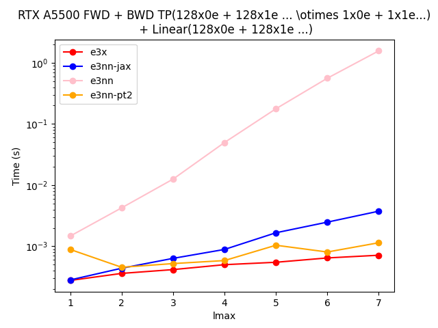
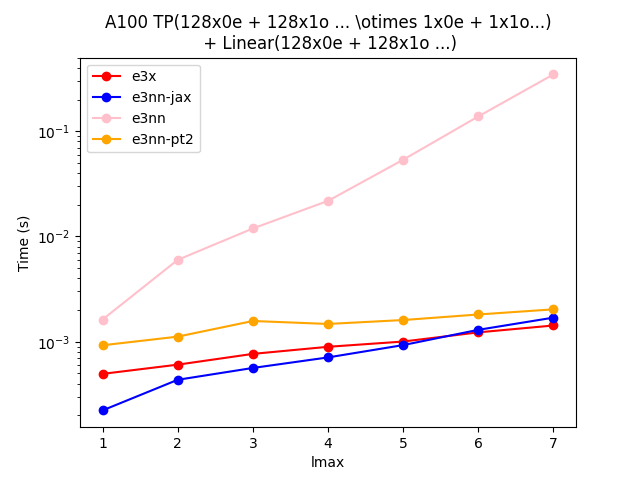

# tinye3nn

> [!CAUTION]
> API is experimental and likely to break

[](https://opensource.org/licenses/MIT)

Marrying [e3nn-torch's](https://github.com/e3nn/e3nn/) flexibilty with [e3nn-jax's](https://github.com/e3nn/e3nn-jax/) performance. Wedding has been blessed by [tinygrad](https://github.com/tinygrad/tinygrad) and [e3x](https://github.com/google-research/e3x/) :wedding:.

## Installation
```console
> python -m pip install .
```

## Amuze Bouche
(credit Mario Geiger for the heading)

```python
import tinye3nn

# Create Irreps as per e3nn convention (currently not supporting other input formats except strings)

x_irreps = tinye3nn.so3.Irreps("32x0e + 32x1o + 32x2e")
y_irreps = tinye3nn.so3.Irreps("0e + 1o + 2e")


# Initialize arrays and move them to the GPU

x = x_irreps.randn()
y = y_irreps.randn()

# Initialize TP + Linear module with the option to specify the device
mod = tinye3nn.nn.TensorProductLinear(x_irreps, y_irreps)

# Run the model :)

out = mod(x, y)
```

## Runtime comparision with other packages in the e3nn-verse

<div class="container">
      <div class="image">
      
      </div> 
      <div class="image">
       
      </div> 
</div>

## Acknowledgement

- e3nn
- e3nn-jax
- e3x
- tinygrad
