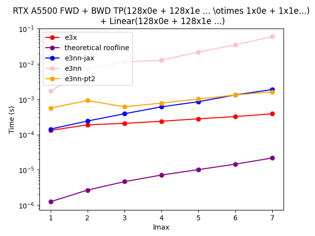
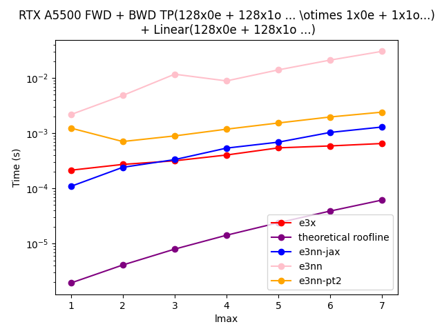
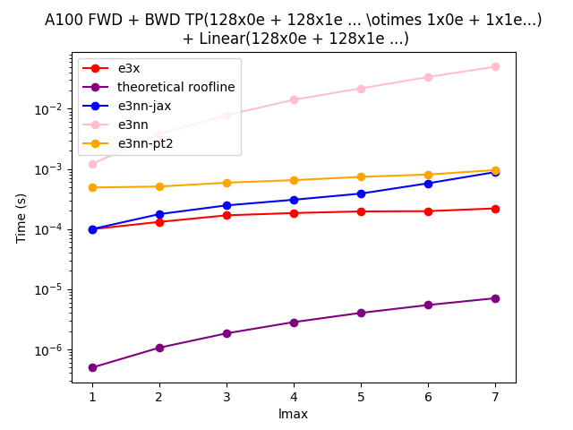
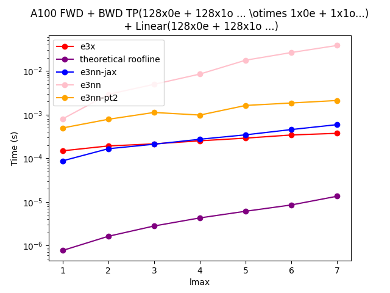

# e3nn-pt2

[](https://opensource.org/licenses/MIT)

[e3nn](https://github.com/e3nn/e3nn/) built for [PyTorch 2.0](https://pytorch.org/get-started/pytorch-2.0/] with a [e3x](https://github.com/google-research/e3x/) memory backend.

## Installation
```console
> python -m pip install .
```

## Amuze-Bouche
(credit [@mariogeiger](https://github.com/mariogeiger) or the heading)

```python
import e3nn_pt2

# Create Irreps as per e3nn convention (currently not supporting other input formats except strings)
x_irreps = e3nn_pt2.so3.Irreps("32x0e + 32x1e + 32x2e")
y_irreps = e3nn_pt2.so3.Irreps("0e + 1o + 2e")


# Initialize arrays and move them to the GPU
x = x_irreps.randn().to(device='cuda')
y = y_irreps.randn().to(device='cuda')

# Initialize TP + Linear module with the option to specify the device
mod = e3nn_pt2.nn.TensorProductLinear(x_irreps, y_irreps).to(device='cuda')

# Run the model :)
out = mod(x, y)
```

## Depth-wise Tensor Product -> Linear layer Forward + Backward Runtime

- [e3nn](https://github.com/e3nn/e3nn/)
- [e3nn-jax](https://github.com/e3nn/e3nn/)
- [e3x](https://github.com/google-research/e3x/)

```python
roofline_time = max(
      model_flops/PEAK_FLOPS_s,
      model_bytes/PEAK_BYTES_s
      )
```

| GPU  | SE(3) | E(3) |
| -----| ------| -----|
| RTXA5500 |  |  |
| A100 |  |  |

## Acknowledgement

- e3nn
- e3nn-jax
- e3x
